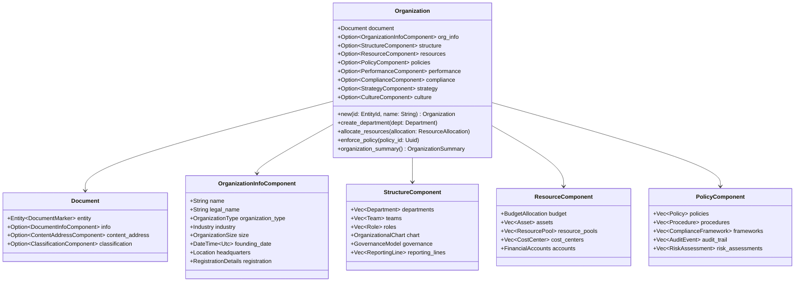
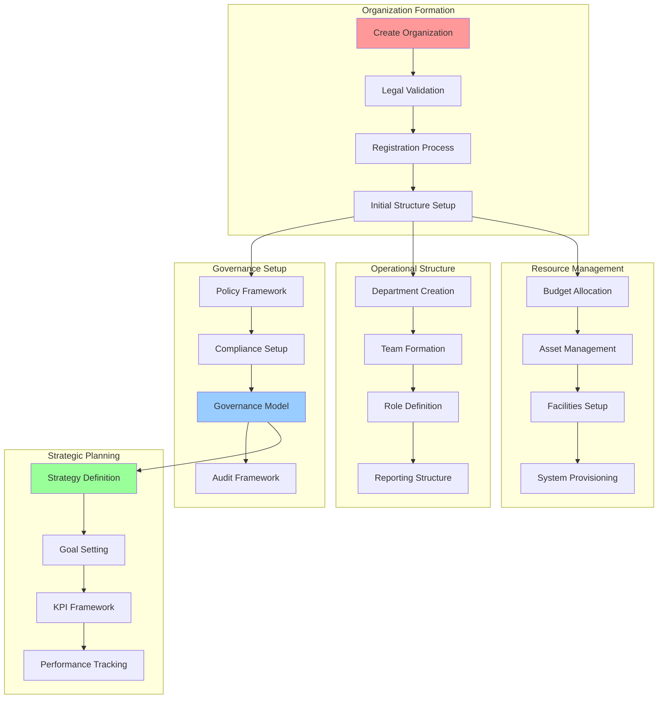

<!--
Copyright 2025 Cowboy AI, LLC.
SPDX-License-Identifier: MIT
-->

# CIM Domain: Organization Extension

[](https://opensource.org/licenses/MIT)
[](https://www.rust-lang.org)

> Organization domain extension for CIM Document system, providing specialized functionality for organizational structure management, governance, compliance, resource allocation, and strategic planning.

## Overview

The Organization domain extends the base `cim-domain-document` with specialized functionality for managing complex organizational structures, from startups to large enterprises. It follows the composition-over-inheritance pattern where `Organization` composes a base `Document` and adds organization-specific components and processing capabilities.

### Key Features

- 🏢 **Organizational Structure Management**: Complete lifecycle management of organizations, departments, teams, and roles
- 🎯 **Strategic Planning & Execution**: Goal setting, strategy definition, and performance tracking
- 📋 **Policy & Governance Framework**: Comprehensive policy management with automated compliance monitoring
- 💰 **Resource Allocation & Management**: Budget management, asset allocation, and financial planning
- 🔍 **Compliance & Audit Operations**: Regulatory compliance automation with audit trail capabilities
- 👥 **Team & Role Management**: Dynamic team formation, role assignment, and organizational restructuring
- 📊 **Analytics & Performance Measurement**: KPI tracking, performance analytics, and organizational health assessment
- 🔄 **Change Management**: Structured organizational transformation with stakeholder management

## Architecture v0.8.0: Pure Functional + NATS Service

**New in v0.8.0**: The Organization Domain now features a production-ready NATS service with pure functional architecture:

### Pure Functional Programming
- **100% Pure Functions**: All domain logic is side-effect free following Category Theory (CT) and Functional Reactive Programming (FRP) principles
- **MealyStateMachine Pattern**: Formal state machine for organizational lifecycle with clear state transitions
- **Event Sourcing**: All state changes captured as immutable events in NATS JetStream
- **Backward Compatible**: Existing code continues to work via compatibility wrappers

### NATS Service Binary
The `organization-service` binary provides:
- **Event Sourcing**: JetStream-based event store with 1-year retention
- **Command Processing**: Subscribe to `organization.commands.>` with automatic routing
- **Snapshot Support**: Configurable snapshot frequency for fast aggregate rebuilding
- **Horizontal Scaling**: Multiple service replicas with NATS queue group load distribution
- **Production Ready**: Graceful shutdown, structured logging, health checks

### Container Deployment
Multi-platform deployment options:

```bash
# Proxmox LXC Container
nix build .#organization-lxc
scp result/tarball/*.tar.xz root@proxmox:/var/lib/vz/template/cache/
pct create 141 /var/lib/vz/template/cache/organization-service.tar.xz \
  --hostname organization-service-1 \
  --net0 name=eth0,bridge=vmbr0,ip=10.0.64.141/19,gw=10.0.64.1 \
  --start 1

# NixOS Container
containers.organization-service = {
  autoStart = true;
  config = { ... }: {
    services.cim-domain-organization = {
      enable = true;
      natsUrl = "nats://10.0.0.41:4222";
      streamName = "ORGANIZATION_EVENTS";
    };
  };
};

# macOS (nix-darwin)
services.cim-domain-organization = {
  enable = true;
  natsUrl = "nats://localhost:4222";
  streamName = "ORGANIZATION_EVENTS";
};

# Run service directly
export NATS_URL=nats://localhost:4222
export STREAM_NAME=ORGANIZATION_EVENTS
cargo run --bin organization-service
```

See [`deployment/CONTAINER_DEPLOYMENT.md`](deployment/CONTAINER_DEPLOYMENT.md) for complete deployment guide.

## Mathematical Foundation

The CIM Organization Domain is built on a formal [Organization Subject Algebra](docs/algebra/README.md) that provides:

- **Rigorous Mathematical Foundation**: 7-tuple algebraic structure with proven properties
- **Type Safety**: Compile-time guarantees for organizational management operations  
- **Compositional Operations**: Sequential (⊕), Parallel (⊗), and Conditional (→) transformations
- **Governance Constraints**: Algebraic compliance rules ensuring regulatory adherence
- **Distributed Processing**: NATS-based implementation of algebraic operations

### Key Algebraic Operations

```
Sequential:   create_organization ⊕ establish_departments ⊕ assign_leadership  
Parallel:     policy_creation ⊗ resource_allocation ⊗ compliance_setup
Conditional:  budget_request →[exceeds_threshold] require_executive_approval
```

See [Organization Subject Algebra Documentation](docs/algebra/README.md) for complete mathematical definitions.

## Architecture

### Organization Profile Composition



### Organization Management Pipeline



## Usage Examples

> **Domain Boundary Note**: The Organization domain defines **positions** and **places** but references actual **people** (from Person domain) and **locations** (from Location domain) through relationships, not internal components.

### Basic Organization Creation

```rust
use cim_domain_organization::prelude::*;
use chrono::NaiveDate;
use uuid::Uuid;

#[tokio::main]
async fn main() -> Result<(), Box<dyn std::error::Error>> {
    // Create an organization (domain-pure)
    let org_id = Uuid::now_v7();

    let create_command = CreateOrganization {
        organization_id: org_id,
        name: "Acme Corporation".to_string(),
        legal_name: "Acme Corporation Inc.".to_string(),
        organization_type: OrganizationType::Corporation,
        industry: Industry::Technology,
        founding_date: NaiveDate::from_ymd_opt(2020, 1, 15).unwrap(),
        // References to other domains via IDs
        headquarters_location_id: None, // Will be set via relationship
    };

    // Send command via NATS
    nats_client
        .publish("organization.commands.create", serde_json::to_vec(&create_command)?)
        .await?;

    // Listen for OrganizationCreated event
    println!("Organization created: {}", org_id);

    Ok(())
}
```

### Defining Organizational Structure (Positions and Places)

```rust
use cim_domain_organization::prelude::*;

#[tokio::main]
async fn main() -> Result<(), Box<dyn std::error::Error>> {
    let org_id = Uuid::now_v7();

    // Define a POSITION (organization domain concept)
    let create_position_cmd = CreateRole {
        organization_id: org_id,
        role_id: Uuid::now_v7(),
        title: "VP of Engineering".to_string(),
        role_type: RoleType::Leadership,
        department: Some("Engineering".to_string()),
        responsibilities: vec![
            "Lead engineering strategy".to_string(),
            "Manage engineering teams".to_string(),
            "Drive technical excellence".to_string(),
        ],
        required_qualifications: vec![
            "10+ years engineering experience".to_string(),
            "5+ years leadership experience".to_string(),
        ],
        reports_to: None, // Will reference another position/role
        // NO person data here - that's a relationship!
    };

    // Define a PLACE (organization domain concept)
    let create_place_cmd = CreateFacility {
        organization_id: org_id,
        facility_id: Uuid::now_v7(),
        name: "San Francisco Engineering Office".to_string(),
        facility_type: FacilityType::Office,
        capacity: Some(150), // Number of workstations
        purpose: "Primary engineering and product development hub".to_string(),
        // References location via ID (from Location domain)
        location_id: None, // Set via relationship to Location domain
    };

    // Assign a PERSON to a POSITION (relationship, not embedding)
    let assign_person_cmd = AssignMemberToRole {
        organization_id: org_id,
        role_id: vp_engineering_role_id,
        person_id: jane_smith_id, // Reference to Person domain
        effective_date: Utc::now(),
        employment_type: EmploymentType::FullTime,
    };

    // Associate a PLACE with a LOCATION (relationship, not embedding)
    let associate_location_cmd = AssociateFacilityWithLocation {
        organization_id: org_id,
        facility_id: sf_office_id,
        location_id: sf_downtown_location_id, // Reference to Location domain
    };

    println!("Organizational structure defined with clean domain boundaries");

    Ok(())
}
```

### Department and Team Structure

```rust
use cim_domain_organization::prelude::*;

#[tokio::main]
async fn main() -> Result<(), Box<dyn std::error::Error>> {
    let org_id = Uuid::now_v7();

    // Create a department (organization domain)
    let create_dept_cmd = CreateDepartment {
        organization_id: org_id,
        department_id: Uuid::now_v7(),
        name: "Engineering".to_string(),
        description: "Software development and engineering operations".to_string(),
        department_type: DepartmentType::Operational,
        budget_amount: 5_000_000.0,
        budget_currency: Currency::USD,
        objectives: vec![
            "Deliver high-quality software products".to_string(),
            "Maintain 99.9% system uptime".to_string(),
            "Scale engineering capabilities by 50%".to_string(),
        ],
    };

    // Create a leadership POSITION for the department
    let dept_head_position = CreateRole {
        organization_id: org_id,
        role_id: Uuid::now_v7(),
        title: "Head of Engineering".to_string(),
        role_type: RoleType::DepartmentHead,
        department: Some("Engineering".to_string()),
        responsibilities: vec![
            "Department strategy and execution".to_string(),
            "Budget management".to_string(),
            "Team development".to_string(),
        ],
        required_qualifications: vec![
            "15+ years engineering experience".to_string(),
            "Proven leadership at scale".to_string(),
        ],
        reports_to: Some(cto_role_id), // References another position
    };

    // Form a team within the department
    let create_team_cmd = FormTeam {
        organization_id: org_id,
        department_id: engineering_dept_id,
        team_id: Uuid::now_v7(),
        name: "Platform Engineering".to_string(),
        team_type: TeamType::Permanent,
        purpose: "Build and maintain core platform infrastructure".to_string(),
        target_size: 8,
        budget_allocation: 1_200_000.0,
    };

    // Define team POSITIONS (not people!)
    let team_positions = vec![
        CreateRole {
            role_id: Uuid::now_v7(),
            title: "Platform Team Lead".to_string(),
            role_type: RoleType::TeamLead,
            department: Some("Engineering".to_string()),
            team: Some("Platform Engineering".to_string()),
            responsibilities: vec!["Team coordination".to_string(), "Technical leadership".to_string()],
            required_qualifications: vec!["8+ years experience".to_string()],
            reports_to: Some(head_of_engineering_role_id),
        },
        CreateRole {
            role_id: Uuid::now_v7(),
            title: "Senior Platform Engineer".to_string(),
            role_type: RoleType::IndividualContributor,
            department: Some("Engineering".to_string()),
            team: Some("Platform Engineering".to_string()),
            responsibilities: vec!["Infrastructure design".to_string(), "System reliability".to_string()],
            required_qualifications: vec!["5+ years experience".to_string()],
            reports_to: Some(team_lead_role_id),
        },
    ];

    // LATER: Assign actual people to these positions via relationships
    // This happens in a separate command that creates the relationship

    println!("Department and team structure defined");
    println!("Positions created - ready for person assignments");

    Ok(())
}
```

### Policy and Compliance Management

```rust
use cim_domain_organization::prelude::*;

#[tokio::main]
async fn main() -> Result<(), Box<dyn std::error::Error>> {
    let policy_service = DefaultPolicyService::new();
    let org_id = EntityId::new();
    
    // Create code of conduct policy
    let code_of_conduct = Policy::new(
        org_id,
        "Code of Conduct Policy".to_string(),
        PolicyType::Behavioral,
        PolicyCategory::WorkplaceConduct,
    )
    .with_version("1.0".to_string())
    .with_effective_date(DateTime::parse_from_rfc3339("2025-01-01T00:00:00Z")?.with_timezone(&Utc))
    .with_scope(PolicyScope::AllEmployees)
    .with_policy_content(PolicyContent {
        summary: "Guidelines for professional conduct and workplace behavior".to_string(),
        detailed_policy_url: "https://policies.company.com/code-of-conduct-v1.0".to_string(),
        key_requirements: vec![
            "Treat all colleagues with respect".to_string(),
            "Maintain confidentiality of sensitive information".to_string(),
            "Report violations through proper channels".to_string(),
            "Comply with all applicable laws and regulations".to_string(),
        ],
    })
    .with_enforcement(EnforcementConfig {
        violation_reporting: ReportingMethod::AnonymousHotline,
        investigation_process: InvestigationProcess::HrLed,
        disciplinary_actions: vec![
            DisciplinaryAction::VerbalWarning,
            DisciplinaryAction::WrittenWarning,
            DisciplinaryAction::Suspension,
            DisciplinaryAction::Termination,
        ],
    })
    .with_training_requirement(TrainingRequirement {
        required: true,
        frequency: TrainingFrequency::Annual,
        completion_deadline: Duration::days(30),
    });
    
    let policy_result = policy_service
        .create_policy(code_of_conduct)
        .await?;
        
    println!("Policy created: {}", policy_result.policy_id);
    
    // Monitor policy compliance
    let compliance_monitor = ComplianceMonitor::new()
        .with_policy(policy_result.policy_id)
        .with_monitoring_frequency(MonitoringFrequency::Continuous)
        .with_violation_detection(ViolationDetection::Automated);
    
    compliance_monitor.start_monitoring().await?;
    
    Ok(())
}
```

### Resource Allocation and Management

```rust
use cim_domain_organization::prelude::*;

#[tokio::main]
async fn main() -> Result<(), Box<dyn std::error::Error>> {
    let resource_service = DefaultResourceService::new();
    let org_id = EntityId::new();
    let dept_id = EntityId::new();
    
    // Allocate budget to department
    let budget_allocation = ResourceAllocation::new(
        org_id,
        ResourceType::Budget,
        AllocationTarget::Department(dept_id),
    )
    .with_resource_details(ResourceDetails::Budget {
        amount: Money::new(2_500_000, Currency::USD),
        allocation_period: AllocationPeriod::Quarterly,
        purpose: "Operational expenses for Q1 2025".to_string(),
    })
    .with_allocation_breakdown(AllocationBreakdown {
        personnel: Percentage::new(60.0),
        technology: Percentage::new(25.0),
        marketing: Percentage::new(10.0),
        operations: Percentage::new(5.0),
    })
    .with_constraints(AllocationConstraints {
        spending_approval_threshold: Money::new(50_000, Currency::USD),
        reallocation_requires_approval: true,
        reporting_frequency: ReportingFrequency::Monthly,
    });
    
    let allocation_result = resource_service
        .allocate_resource(budget_allocation)
        .await?;
        
    println!("Resource allocated: {}", allocation_result.allocation_id);
    
    // Request additional resources
    let resource_request = ResourceRequest::new(
        dept_id,
        ResourceType::AdditionalHeadcount,
    )
    .with_request_details(RequestDetails::Headcount {
        headcount_increase: 5,
        roles_requested: vec![
            RoleRequest {
                title: "Senior Software Engineer".to_string(),
                count: 3,
                urgency: RequestUrgency::High,
            },
            RoleRequest {
                title: "Product Manager".to_string(),
                count: 2,
                urgency: RequestUrgency::Medium,
            },
        ],
    })
    .with_business_justification(BusinessJustification {
        reason: "Increased product demand".to_string(),
        expected_roi: Percentage::new(300.0),
        timeline: "Q2 2025".to_string(),
        risk_if_not_approved: "Missed revenue targets".to_string(),
    })
    .with_budget_impact(Money::new(850_000, Currency::USD))
    .with_priority(RequestPriority::High);
    
    let request_result = resource_service
        .submit_resource_request(resource_request)
        .await?;
        
    println!("Resource request submitted: {}", request_result.request_id);
    
    Ok(())
}
```

### Strategic Planning and Performance Management

```rust
use cim_domain_organization::prelude::*;

#[tokio::main]
async fn main() -> Result<(), Box<dyn std::error::Error>> {
    let strategy_service = DefaultStrategyService::new();
    let performance_service = DefaultPerformanceService::new();
    let org_id = EntityId::new();
    
    // Define organizational strategy
    let strategy = OrganizationalStrategy::new(
        org_id,
        "Digital Transformation 2025".to_string(),
        StrategyType::Digital,
    )
    .with_vision("Become the leading digital-first organization in our industry".to_string())
    .with_strategic_objectives(vec![
        StrategicObjective::new(
            "Digital Customer Experience".to_string(),
            "Digitize 100% of customer touchpoints".to_string(),
            ObjectiveType::CustomerFocused,
        ).with_target_metrics(vec![
            TargetMetric::new("digital_adoption_rate", 95.0, MetricUnit::Percentage),
            TargetMetric::new("customer_satisfaction", 4.5, MetricUnit::Score),
        ]),
        StrategicObjective::new(
            "Operational Excellence".to_string(),
            "Achieve operational efficiency through automation".to_string(),
            ObjectiveType::Operational,
        ).with_target_metrics(vec![
            TargetMetric::new("process_automation", 80.0, MetricUnit::Percentage),
            TargetMetric::new("cost_reduction", 15.0, MetricUnit::Percentage),
        ]),
    ])
    .with_timeline(StrategyTimeline {
        start_date: DateTime::parse_from_rfc3339("2025-01-01T00:00:00Z")?.with_timezone(&Utc),
        end_date: DateTime::parse_from_rfc3339("2025-12-31T23:59:59Z")?.with_timezone(&Utc),
        milestones: vec![
            Milestone::new("Q1: Foundation Phase", "2025-03-31"),
            Milestone::new("Q2: Implementation Phase", "2025-06-30"),
            Milestone::new("Q3: Optimization Phase", "2025-09-30"),
            Milestone::new("Q4: Excellence Phase", "2025-12-31"),
        ],
    });
    
    let strategy_result = strategy_service
        .define_strategy(strategy)
        .await?;
        
    println!("Strategy defined: {}", strategy_result.strategy_id);
    
    // Track performance metrics
    let performance_measurement = PerformanceMeasurement::new(
        org_id,
        MeasurementScope::Organization,
    )
    .with_metrics(vec![
        PerformanceMetric::new("employee_satisfaction", 4.2, MetricScale::OneToFive),
        PerformanceMetric::new("productivity_index", 87.5, MetricScale::ZeroToHundred),
        PerformanceMetric::new("retention_rate", 94.2, MetricScale::Percentage),
        PerformanceMetric::new("innovation_index", 76.8, MetricScale::ZeroToHundred),
    ])
    .with_reporting_period(ReportingPeriod::Quarterly)
    .with_benchmarks(BenchmarkData {
        industry_average: 82.1,
        company_target: 90.0,
        previous_period: 85.3,
    });
    
    let measurement_result = performance_service
        .record_measurement(performance_measurement)
        .await?;
        
    println!("Performance measured: {}", measurement_result.measurement_id);
    
    // Generate organizational health assessment
    let health_assessment = performance_service
        .assess_organizational_health(org_id)
        .await?;
        
    println!("Organizational Health Assessment:");
    println!("- Overall Score: {:.1}/10", health_assessment.overall_score);
    println!("- Financial Health: {:.1}/10 ({})", 
             health_assessment.dimensions.financial_health.score,
             health_assessment.dimensions.financial_health.trend);
    println!("- Employee Engagement: {:.1}/10 ({})",
             health_assessment.dimensions.employee_engagement.score,
             health_assessment.dimensions.employee_engagement.trend);
    
    Ok(())
}
```

### Organizational Change Management

```rust
use cim_domain_organization::prelude::*;

#[tokio::main]
async fn main() -> Result<(), Box<dyn std::error::Error>> {
    let change_service = DefaultChangeService::new();
    let org_id = EntityId::new();
    
    // Initiate organizational restructuring
    let change_request = ChangeRequest::new(
        org_id,
        "Digital Transformation Restructuring".to_string(),
        ChangeType::Restructuring,
    )
    .with_description("Reorganize teams to support digital-first operations".to_string())
    .with_scope(ChangeScope {
        affected_departments: vec!["engineering", "product", "marketing"],
        affected_employees: 125,
        systems_impacted: vec!["hr_system", "org_chart", "access_controls"],
        budget_impact: Money::new(500_000, Currency::USD),
    })
    .with_business_justification(ChangeJustification {
        drivers: vec![
            "Market demands for digital services",
            "Competitive advantage through agility",
            "Operational efficiency improvements",
        ],
        expected_benefits: vec![
            "30% faster product delivery",
            "Improved cross-functional collaboration", 
            "Enhanced customer experience",
        ],
        risks_if_not_implemented: vec![
            "Loss of market share",
            "Decreased employee satisfaction",
            "Operational inefficiencies",
        ],
    })
    .with_timeline(ChangeTimeline {
        planning_phase: Duration::weeks(2),
        communication_phase: Duration::weeks(1),
        implementation_phase: Duration::weeks(4),
        stabilization_phase: Duration::weeks(2),
    });
    
    let change_result = change_service
        .initiate_change(change_request)
        .await?;
        
    println!("Change initiative started: {}", change_result.change_id);
    
    // Conduct impact assessment
    let impact_assessment = change_service
        .assess_change_impact(change_result.change_id)
        .await?;
        
    println!("Impact Assessment Results:");
    println!("- Employee Impact: {:?}", impact_assessment.employee_impact);
    println!("- System Changes: {:?}", impact_assessment.system_changes);
    println!("- Risk Level: {:?}", impact_assessment.overall_risk);
    
    // Create change management workflow
    let change_workflow = ChangeWorkflow::new(change_result.change_id)
        .add_phase(ChangePhase::Planning {
            stakeholder_analysis: true,
            communication_strategy: true,
            risk_mitigation_plan: true,
        })
        .add_phase(ChangePhase::Communication {
            town_halls: 3,
            training_sessions: 8,
            feedback_collection: true,
        })
        .add_phase(ChangePhase::Implementation {
            phased_rollout: true,
            pilot_groups: vec!["engineering_team_alpha"],
            monitoring_frequency: MonitoringFrequency::Daily,
        })
        .add_phase(ChangePhase::Stabilization {
            performance_monitoring: Duration::weeks(4),
            feedback_analysis: true,
            lessons_learned: true,
        });
    
    let workflow_result = change_service
        .execute_change_workflow(change_workflow)
        .await?;
        
    println!("Change workflow initiated: {}", workflow_result.workflow_id);
    
    Ok(())
}
```

## Organization Components

> **Domain Purity**: Organization components define **positions** (roles), **places** (facilities), and **organizational structure**. They reference people and locations via IDs, never embed them.

### OrganizationInfoComponent

Core organizational identity and legal information:

```rust
pub struct OrganizationInfoComponent {
    pub name: String,
    pub legal_name: String,
    pub organization_type: OrganizationType,
    pub industry: Industry,
    pub size: OrganizationSize,
    pub founding_date: DateTime<Utc>,

    // References to other domains
    pub headquarters_location_id: Option<Uuid>, // Location domain reference
    pub registration_details: RegistrationDetails,

    // Financial summary (organization-specific)
    pub annual_revenue: Option<Money>,
    pub annual_budget: Option<Money>,

    // Organizational metrics (NOT person data)
    pub position_count: u32,      // Number of defined positions
    pub filled_position_count: u32, // How many have assigned people

    // Status and lifecycle
    pub status: OrganizationStatus,
    pub lifecycle_stage: LifecycleStage,
}
```

### StructureComponent

Organizational hierarchy with positions and facilities:

```rust
pub struct StructureComponent {
    // Organizational units
    pub departments: Vec<Department>,
    pub teams: Vec<Team>,

    // POSITIONS (not people!) - organization domain owns these
    pub roles: Vec<Role>,  // VP Engineering, Senior Engineer, etc.
    pub reporting_lines: Vec<ReportingLine>, // Position A reports to Position B

    // PLACES (not locations!) - organization domain owns these
    pub facilities: Vec<Facility>, // "SF Office", "NYC Warehouse", etc.

    // Structure visualization
    pub organizational_chart: OrganizationalChart,
    pub governance_model: GovernanceModel,
    pub decision_matrix: DecisionMatrix,
}

impl StructureComponent {
    /// Get position hierarchy (not people!)
    pub fn get_hierarchy(&self) -> OrganizationalHierarchy;

    /// Find reporting chain for a position (returns positions, not people)
    pub fn find_reporting_chain(&self, role_id: Uuid) -> Vec<Role>;

    /// Calculate span of control for a position
    pub fn calculate_span_of_control(&self, manager_role_id: Uuid) -> u32;

    /// Validate structure consistency
    pub fn validate_structure_consistency(&self) -> StructureValidationResult;
}
```

### Key Domain Concepts

**Positions vs People**:
- `Role` = A position in the organization ("VP of Engineering")
- `Person` = An actual human (from Person domain)
- Relationship: `PersonRoleAssignment { person_id, role_id, effective_date }`

**Places vs Locations**:
- `Facility` = An organizational place ("San Francisco Office", "Building 42")
- `Location` = Physical address (from Location domain)
- Relationship: `FacilityLocationAssignment { facility_id, location_id }`

### ResourceComponent

Financial and physical resource management:

```rust
pub struct ResourceComponent {
    pub budget_allocation: BudgetAllocation,
    pub financial_accounts: Vec<Account>,
    pub assets: Vec<Asset>,
    pub resource_pools: Vec<ResourcePool>,
    pub cost_centers: Vec<CostCenter>,
    pub resource_utilization: ResourceUtilization,
}

impl ResourceComponent {
    pub fn calculate_total_budget(&self) -> Money;
    pub fn get_available_budget(&self, period: TimePeriod) -> Money;
    pub fn track_resource_utilization(&self) -> UtilizationReport;
    pub fn forecast_resource_needs(&self, horizon: Duration) -> ResourceForecast;
}
```

### PolicyComponent

Governance, compliance, and policy management:

```rust
pub struct PolicyComponent {
    pub policies: Vec<Policy>,
    pub procedures: Vec<Procedure>,
    pub compliance_frameworks: Vec<ComplianceFramework>,
    pub audit_trail: Vec<AuditEvent>,
    pub risk_assessments: Vec<RiskAssessment>,
    pub governance_rules: Vec<GovernanceRule>,
}

impl PolicyComponent {
    pub fn check_compliance(&self, framework: ComplianceFramework) -> ComplianceStatus;
    pub fn enforce_policy(&self, policy_id: Uuid, context: EnforcementContext) -> EnforcementResult;
    pub fn generate_audit_report(&self, period: TimePeriod) -> AuditReport;
    pub fn assess_policy_effectiveness(&self) -> PolicyEffectivenessReport;
}
```

## Governance & Compliance

The Organization domain includes comprehensive governance and compliance features:

### Regulatory Compliance Features
- **Multi-Framework Support**: SOX, GDPR, HIPAA, ISO 27001, OSHA compliance
- **Automated Monitoring**: Continuous compliance checking with real-time alerts
- **Audit Trail**: Complete traceability of all organizational changes
- **Risk Assessment**: Continuous risk monitoring with mitigation planning
- **Regulatory Reporting**: Automated generation of compliance reports

### Governance Configuration

```rust
let governance_settings = GovernanceSettings {
    compliance_frameworks: vec![
        ComplianceFramework::SOX,
        ComplianceFramework::GDPR,
        ComplianceFramework::ISO27001,
    ],
    audit_frequency: AuditFrequency::Quarterly,
    risk_tolerance: RiskTolerance::Conservative,
    approval_hierarchies: ApprovalHierarchies::default(),
    segregation_of_duties: true,
    financial_controls: FinancialControls::Strict,
};
```

## Workflow System

Pre-defined workflows for organizational operations:

### Organization Formation Workflow
```rust
let formation_workflow = OrganizationFormationWorkflow::new()
    .add_step(LegalSetupStep::new())
    .add_step(RegistrationStep::new())
    .add_step(InitialStructureStep::new())
    .add_step(PolicyFrameworkStep::new())
    .add_step(ComplianceSetupStep::new())
    .add_step(ResourceAllocationStep::new())
    .add_step(ActivationStep::new());

let result = formation_workflow.execute(formation_data).await?;
```

### Available Workflows
- **Organization Formation**: Complete legal entity setup and activation
- **Department Restructuring**: Organizational structure changes and team transitions
- **Strategic Planning**: Strategy definition, goal setting, and execution tracking
- **Compliance Auditing**: Regulatory compliance assessment and reporting
- **Change Management**: Organizational transformation with stakeholder management
- **Performance Management**: KPI tracking, assessment, and improvement planning
- **Risk Management**: Risk identification, assessment, and mitigation
- **Policy Lifecycle**: Policy creation, review, approval, and enforcement

## Configuration

### Feature Flags

Optional dependencies can be enabled through Cargo features:

```toml
[dependencies]
cim-domain-organization = { version = "0.5.0", features = ["compliance", "analytics", "governance"] }
```

Available features:
- `compliance`: Enable comprehensive compliance and audit features
- `analytics`: Enable advanced analytics and performance measurement
- `governance`: Enable advanced governance and policy management
- `strategic-planning`: Enable strategic planning and execution tracking
- `change-management`: Enable organizational change management capabilities
- `full`: Enable all features

### Governance & Compliance Settings

Configure governance and compliance parameters:

```rust
let settings = OrganizationDomainSettings {
    legal_validation_timeout: Duration::from_secs(600),
    max_organizational_depth: 8,
    budget_approval_threshold: Money::new(100_000, Currency::USD),
    require_dual_authorization: true,
    audit_retention_period: Duration::days(2555), // 7 years
    compliance_monitoring_interval: Duration::hours(1),
    risk_assessment_frequency: Duration::days(30),
    governance_mode: GovernanceMode::Strict,
};
```

## Examples

See the [examples](examples/) directory for complete working examples:

- [`organization_lifecycle.rs`](examples/organization_lifecycle.rs) - Complete organization management workflow
- [`department_management.rs`](examples/department_management.rs) - Department creation and restructuring
- [`resource_allocation.rs`](examples/resource_allocation.rs) - Budget and resource management
- [`policy_compliance.rs`](examples/policy_compliance.rs) - Policy management and compliance monitoring
- [`strategic_planning.rs`](examples/strategic_planning.rs) - Strategic planning and performance tracking
- [`change_management.rs`](examples/change_management.rs) - Organizational change and transformation
- [`governance_framework.rs`](examples/governance_framework.rs) - Governance and audit operations

## Development

### Prerequisites

```bash
# Enter development shell
nix develop

# Install optional dependencies for full functionality
sudo apt-get install libssl-dev          # For legal validation APIs
sudo apt-get install libsqlite3-dev      # For local compliance data
sudo apt-get install libxml2-dev         # For regulatory document processing
```

### Testing

```bash
# Run all tests
cargo test

# Run with specific features
cargo test --features "compliance,analytics,governance"

# Run integration tests
cargo test --test "*_integration_test"

# Run compliance tests
cargo test --test "compliance_*" --features compliance

# Run governance tests
cargo test --test "governance_*" --features governance
```

### Building

```bash
# Development build
cargo build

# Release build with optimizations
cargo build --release --features full
```

## Documentation

### Core Documentation
- [Organization Subject Algebra](docs/algebra/README.md) - Mathematical foundations
- [NATS API Reference](docs/api/README.md) - Complete API documentation
- [Cross-Reference Index](docs/cross-reference.md) - Links between concepts and implementation

### Integration Guides
- [Configuration Guide](docs/configuration/README.md) - Service configuration
- [Deployment Guide](docs/deployment/README.md) - Production deployment
- [Governance & Compliance Guide](docs/compliance/README.md) - Regulatory compliance
- [Security Best Practices](docs/security/README.md) - Security model

### Workflow Documentation
- [Formation Workflows](docs/workflows/formation/README.md) - Organization setup
- [Governance Workflows](docs/workflows/governance/README.md) - Governance operations
- [Compliance Workflows](docs/workflows/compliance/README.md) - Regulatory compliance
- [Change Management Workflows](docs/workflows/change/README.md) - Organizational transformation

### Specialized Guides
- [Strategic Planning](docs/strategy/README.md) - Strategic planning framework
- [Performance Management](docs/performance/README.md) - Performance measurement and optimization
- [Risk Management](docs/risk/README.md) - Enterprise risk management
- [Financial Management](docs/financial/README.md) - Budget and resource management

## License

This project is licensed under the MIT License - see the [LICENSE](../../LICENSE) file for details.

## Copyright

Copyright 2025 Cowboy AI, LLC.