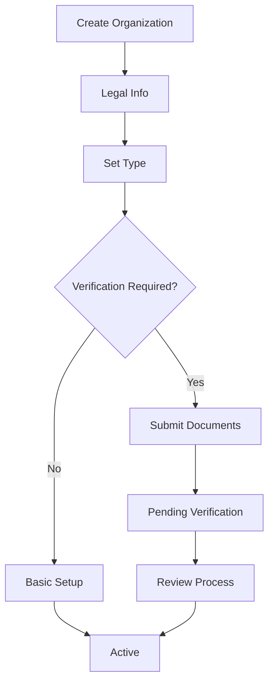
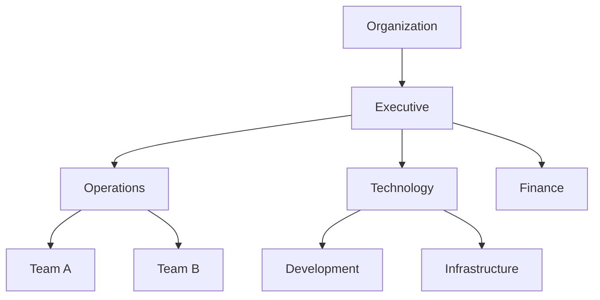
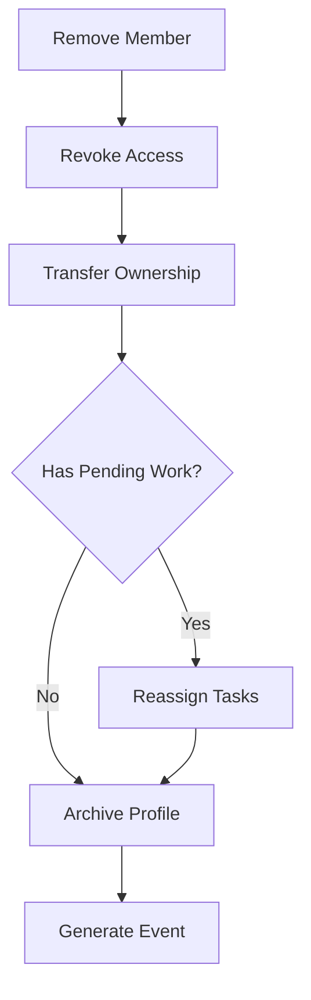
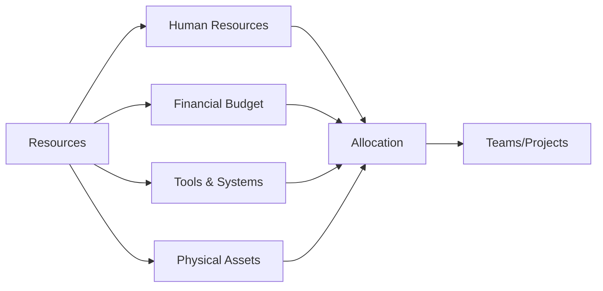
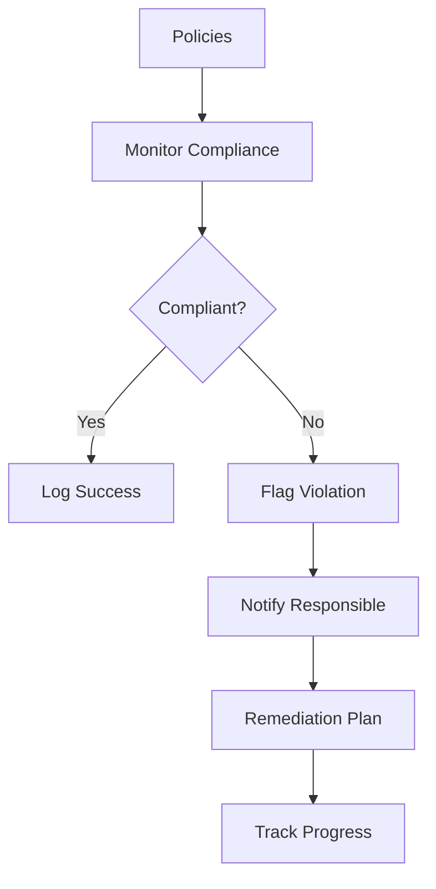
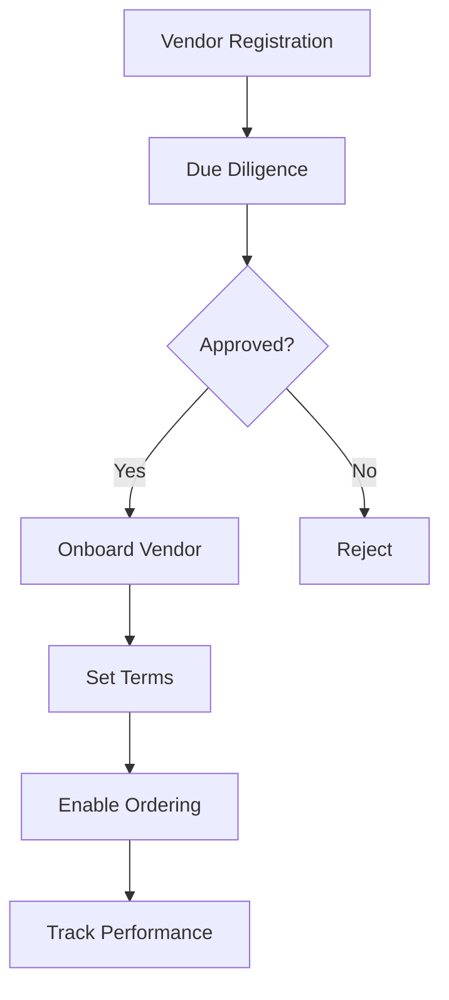

# User Stories for Organization Domain

## Overview

User stories for the Organization domain module, which manages organizational entities, hierarchies, teams, and collaborative structures in the CIM system.

## Organization Creation and Management

### Story O1: Create Organization
**As an** organization founder  
**I want** to create an organization entity  
**So that** we can collaborate as a group

**Acceptance Criteria:**
- Organization created with unique ID
- Legal entity information captured
- OrganizationCreated event generated
- Founder assigned as owner
- Initial settings configured

**Mermaid Diagram:**

**Tests:** `test_create_organization`, `test_organization_verification`

### Story O2: Update Organization Profile
**As an** organization administrator  
**I want** to update our organization profile  
**So that** information stays current

**Acceptance Criteria:**
- Profile fields editable (description, logo, mission)
- OrganizationUpdated event generated
- Change history tracked
- Admin approval for critical changes
- Public/private field controls

**Tests:** `test_update_org_profile`, `test_change_approval`

### Story O3: Define Organization Structure
**As an** organization leader  
**I want** to define our organizational structure  
**So that** hierarchy is clear

**Acceptance Criteria:**
- Departments/divisions creatable
- Hierarchical relationships
- StructureDefined event generated
- Org chart visualization
- Position assignments

**Mermaid Diagram:**

**Tests:** `test_define_structure`, `test_hierarchy_validation`

## Member Management

### Story O4: Invite Members
**As an** organization administrator  
**I want** to invite people to join  
**So that** we can build our team

**Acceptance Criteria:**
- Email invitations sent
- InvitationSent event generated
- Invitation expiry configurable
- Role pre-assignment
- Bulk invite capability

**Tests:** `test_invite_members`, `test_bulk_invitations`

### Story O5: Manage Member Roles
**As an** organization administrator  
**I want** to assign roles to members  
**So that** permissions are appropriate

**Acceptance Criteria:**
- Predefined roles available
- Custom roles creatable
- RoleAssigned event generated
- Role inheritance
- Effective permissions display

**Tests:** `test_assign_roles`, `test_role_inheritance`

### Story O6: Remove Members
**As an** organization administrator  
**I want** to remove members  
**So that** access is controlled

**Acceptance Criteria:**
- Graceful member removal
- MemberRemoved event generated
- Access immediately revoked
- Data ownership transfer
- Exit checklist

**Mermaid Diagram:**

**Tests:** `test_remove_member`, `test_ownership_transfer`

## Team Management

### Story O7: Create Teams
**As a** team leader  
**I want** to create teams within the organization  
**So that** we can organize work groups

**Acceptance Criteria:**
- Team creation with purpose
- Team members assignment
- TeamCreated event generated
- Team channels/spaces
- Cross-functional teams supported

**Tests:** `test_create_team`, `test_team_membership`

### Story O8: Manage Team Permissions
**As a** team leader  
**I want** to set team permissions  
**So that** teams can work autonomously

**Acceptance Criteria:**
- Permission sets per team
- Resource access control
- PermissionsUpdated event generated
- Permission inheritance
- Override capabilities

**Tests:** `test_team_permissions`, `test_permission_override`

### Story O9: Track Team Performance
**As a** team leader  
**I want** to track team metrics  
**So that** we can improve performance

**Acceptance Criteria:**
- KPI definition per team
- Metric collection automated
- PerformanceTracked events
- Dashboard visualization
- Trend analysis

**Tests:** `test_team_metrics`, `test_performance_tracking`

## Resource Management

### Story O10: Allocate Resources
**As an** organization manager  
**I want** to allocate resources to teams  
**So that** work can proceed efficiently

**Acceptance Criteria:**
- Resource types defined
- Allocation tracking
- ResourceAllocated event generated
- Budget constraints
- Utilization reports

**Mermaid Diagram:**

**Tests:** `test_resource_allocation`, `test_budget_constraints`

### Story O11: Manage Organization Assets
**As an** asset manager  
**I want** to track organizational assets  
**So that** we maintain inventory control

**Acceptance Criteria:**
- Asset registration system
- Lifecycle tracking
- AssetRegistered events
- Depreciation tracking
- Assignment to members

**Tests:** `test_asset_management`, `test_asset_lifecycle`

## Compliance and Governance

### Story O12: Define Policies
**As a** compliance officer  
**I want** to define organizational policies  
**So that** governance is maintained

**Acceptance Criteria:**
- Policy templates available
- Version control
- PolicyDefined event generated
- Acknowledgment tracking
- Enforcement rules

**Tests:** `test_define_policies`, `test_policy_enforcement`

### Story O13: Track Compliance
**As a** compliance officer  
**I want** to track policy compliance  
**So that** we meet regulations

**Acceptance Criteria:**
- Compliance metrics defined
- Automated checking
- ComplianceChecked events
- Exception handling
- Audit reports

**Mermaid Diagram:**

**Tests:** `test_compliance_tracking`, `test_violation_handling`

### Story O14: Manage Certifications
**As an** organization administrator  
**I want** to manage org certifications  
**So that** credentials are maintained

**Acceptance Criteria:**
- Certification tracking
- Renewal reminders
- CertificationUpdated events
- Public display options
- Verification links

**Tests:** `test_org_certifications`, `test_renewal_tracking`

## Communication and Collaboration

### Story O15: Create Announcement Channels
**As an** organization communicator  
**I want** to create announcement channels  
**So that** information flows effectively

**Acceptance Criteria:**
- Channel types (all-hands, team, topic)
- Subscription management
- AnnouncementPosted events
- Priority levels
- Read receipts

**Tests:** `test_announcement_channels`, `test_message_delivery`

### Story O16: Manage Organization Calendar
**As an** organization coordinator  
**I want** to manage shared calendars  
**So that** events are coordinated

**Acceptance Criteria:**
- Shared calendar creation
- Event scheduling
- EventScheduled events generated
- Conflict detection
- RSVP tracking

**Tests:** `test_org_calendar`, `test_event_scheduling`

## External Relations

### Story O17: Manage Partnerships
**As a** partnership manager  
**I want** to track partner organizations  
**So that** relationships are maintained

**Acceptance Criteria:**
- Partner organization linking
- Relationship types
- PartnershipEstablished events
- Collaboration spaces
- Contract tracking

**Tests:** `test_partnership_management`, `test_partner_collaboration`

### Story O18: Handle Vendor Relationships
**As a** procurement manager  
**I want** to manage vendor relationships  
**So that** supply chain works smoothly

**Acceptance Criteria:**
- Vendor registration
- Performance tracking
- VendorOnboarded events
- Contract management
- Payment terms

**Mermaid Diagram:**

**Tests:** `test_vendor_management`, `test_vendor_performance`

## Analytics and Reporting

### Story O19: Generate Organization Reports
**As an** executive  
**I want** comprehensive org reports  
**So that** I can make informed decisions

**Acceptance Criteria:**
- Standard report templates
- Custom report builder
- ReportGenerated events
- Scheduled reports
- Export formats

**Tests:** `test_report_generation`, `test_report_scheduling`

### Story O20: Track Organization Growth
**As a** strategic planner  
**I want** to track growth metrics  
**So that** we can plan effectively

**Acceptance Criteria:**
- Growth KPIs defined
- Trend analysis
- GrowthMilestone events
- Forecasting tools
- Benchmark comparisons

**Tests:** `test_growth_tracking`, `test_forecasting`

## Legend

- 🏢 Core organization functionality
- 👥 Member and team management
- 📊 Analytics and reporting
- 🤝 External relationships

## Test Coverage Requirements

- Unit tests for all organization operations
- Integration tests for member flows
- Permission tests for access control
- Performance tests for large organizations
- Compliance tests for governance 