<!--
Copyright 2025 Cowboy AI, LLC.
SPDX-License-Identifier: MIT
-->

# CIM Organization Domain Subject Algebra

> Mathematical foundations for organization management operations within the Composable Information Machine (CIM) architecture.

## Table of Contents

- [Formal Definition](#formal-definition)
- [Mathematical Properties](#mathematical-properties)
- [Algebraic Operations](#algebraic-operations)
- [Type System](#type-system-and-safety)
- [Organization Processing Workflows](#organization-processing-workflows)
- [Composition Laws](#composition-laws)
- [Implementation Mapping](#implementation-mapping)

## Formal Definition

The **Organization Subject Algebra** is formally defined as a 7-tuple:

```
𝒪 = (ℐ, ℰ, 𝒮, 𝒞, ⊕, ⊗, →)
```

Where:

- **ℐ** = Set of organization identifiers and entities
- **ℰ** = Set of organization events and state transitions  
- **𝒮** = Set of NATS subjects for organization operations
- **𝒞** = Set of organizational contexts and scoping rules
- **⊕** = Sequential composition operator (workflow chaining)
- **⊗** = Parallel composition operator (concurrent operations)
- **→** = Conditional transformation operator (business rule application)

### Core Components

#### Organization Identifiers (ℐ)
```
ℐ = {Organization, Department, Team, Role, Policy, Resource, 
     Structure, Culture, Strategy, Performance, Communication, 
     Change, Risk, Vendor, Location}

∀ i ∈ ℐ : i = (uuid, type, metadata, relationships)
```

#### Organization Events (ℰ)
```
ℰ = {Created, Updated, Merged, Dissolved, Restructured, 
     Transferred, Allocated, Measured, Violated, Complied}

∀ e ∈ ℰ : e = (timestamp, actor, aggregate, payload, context)
```

#### NATS Subjects (𝒮)
```
𝒮 = {events, commands, queries, workflows, system, 
     analytics, compliance, integration} × ℐ × 𝒞

Subject Pattern: root.organization.aggregate.scope.operation.entity_id
```

#### Organizational Contexts (𝒞)
```
𝒞 = {Global, Organization(id), Department(id), Team(id), 
     Role(id), Location(loc), Region(region), Division(id),
     Project(id), CostCenter(cc), Vendor(id)}

∀ c ∈ 𝒞 : scope(c) ⊆ permissions(actor)
```

## Mathematical Properties

### 1. Associativity Property

For sequential composition (⊕):
```
∀ a, b, c ∈ 𝒪 : (a ⊕ b) ⊕ c = a ⊕ (b ⊕ c)
```

**Organization Example:**
```
(create_org ⊕ create_dept) ⊕ assign_employees = 
create_org ⊕ (create_dept ⊕ assign_employees)
```

**Proof:**
Organization lifecycle operations naturally compose associatively because each operation produces output that serves as valid input for subsequent operations, regardless of grouping.

```mermaid
graph LR
    subgraph "Left Association: (a ⊕ b) ⊕ c"
        A1[create_org] --> B1[create_dept]
        B1 --> C1[assign_employees]
        
        style A1 fill:#ffcccc
        style B1 fill:#ccffcc  
        style C1 fill:#ccccff
    end
    
    subgraph "Right Association: a ⊕ (b ⊕ c)"  
        A2[create_org] --> B2[create_dept]
        B2 --> C2[assign_employees]
        
        style A2 fill:#ffcccc
        style B2 fill:#ccffcc
        style C2 fill:#ccccff
    end
```



### 2. Commutativity Property  

For parallel composition (⊗):
```
∀ a, b ∈ 𝒪 : a ⊗ b = b ⊗ a
```

**Organization Example:**
```
create_dept ⊗ define_policies = define_policies ⊗ create_dept
```

**Proof:**
Independent organizational operations can be executed in any order when they don't share dependencies, making parallel composition commutative.

```mermaid
graph TB
    subgraph "Forward: a ⊗ b"
        A1[create_dept] 
        B1[define_policies]
        C1[Result State]
        
        A1 --> C1
        B1 --> C1
    end
    
    subgraph "Reverse: b ⊗ a"
        A2[define_policies]
        B2[create_dept]  
        C2[Result State]
        
        A2 --> C2
        B2 --> C2
    end
    
    C1 -.->|"Same State"| C2
    
    style C1 fill:#e1f5fe
    style C2 fill:#e1f5fe
```



### 3. Distributive Laws

Sequential over parallel:
```
∀ a, b, c ∈ 𝒪 : a ⊕ (b ⊗ c) = (a ⊕ b) ⊗ (a ⊕ c)
```

**Organization Example:**
```
org_created ⊕ (setup_hr ⊗ setup_finance) = 
(org_created ⊕ setup_hr) ⊗ (org_created ⊕ setup_finance)
```


## Algebraic Operations

### Sequential Composition (⊕)

Chains organization operations in dependent sequence:

```
create_organization ⊕ establish_departments ⊕ hire_employees ⊕ assign_roles
```

**NATS Subject Sequence:**
```
events.organization.organization.global.created.{org_id}
  → commands.organization.department.org.{org_id}.create.{dept_id}
  → events.organization.department.org.{org_id}.created.{dept_id}
  → commands.organization.role.dept.{dept_id}.assign.{role_id}
```

**Implementation:**
```rust
impl SequentialComposition for OrganizationOperation {
    fn compose(self, next: OrganizationOperation) -> OrganizationWorkflow {
        OrganizationWorkflow::new()
            .add_step(self)
            .add_step_with_dependency(next, self.output_requirements())
    }
}
```

### Parallel Composition (⊗)

Executes independent organization operations concurrently:

```
setup_hr_policies ⊗ configure_finance ⊗ establish_it_infrastructure
```

**NATS Subject Parallel:**
```
commands.organization.policy.org.{org_id}.create.hr_policies
∥
commands.organization.resource.org.{org_id}.allocate.finance_budget  
∥
commands.organization.resource.org.{org_id}.provision.it_systems
```

**Implementation:**
```rust
impl ParallelComposition for OrganizationOperation {
    async fn compose_parallel(operations: Vec<OrganizationOperation>) -> OrganizationResult {
        let handles: Vec<_> = operations.into_iter()
            .map(|op| tokio::spawn(async move { op.execute().await }))
            .collect();
            
        let results = futures::future::join_all(handles).await;
        OrganizationResult::merge(results)
    }
}
```

### Conditional Transformation (→)

Applies business rules and organizational policies:

```
employee_hired →[needs_security_clearance] initiate_background_check
department_created →[budget_threshold_exceeded] require_executive_approval
policy_violation →[severity_high] escalate_to_leadership
```

**NATS Subject Conditional:**
```
events.organization.role.org.{org_id}.assigned.{person_id}
  →[security_level == "classified"]
commands.organization.compliance.org.{org_id}.initiate_background_check.{person_id}
```

**Implementation:**
```rust
impl ConditionalTransformation for OrganizationRule {
    fn apply(&self, event: &OrganizationEvent) -> Option<OrganizationCommand> {
        if self.condition.evaluate(event) {
            Some(self.action.create_command(event))
        } else {
            None
        }
    }
}
```

## Type System and Safety

### Organization Type Hierarchy


### Type Safety Rules

1. **Organization Validation Rule:**
   ```
   ∀ o ∈ OrganizationData : validate(o) → ValidatedOrganization ∪ ValidationError
   ```

2. **Department Funding Rule:**
   ```
   ∀ d ∈ Department : fund(d) ⟸ budget_approved(d) ∧ parent_org_active(d)
   ```

3. **Role Assignment Rule:**
   ```
   ∀ r ∈ Role, p ∈ Person : assign(r, p) ⟸ 
   qualified(p, r) ∧ authorized(assigner) ∧ available(r)
   ```

### Component Types

#### Core Organization Components
```rust
// Organizational identity and basic information
pub struct OrganizationInfoComponent {
    pub name: String,
    pub legal_name: String,
    pub organization_type: OrganizationType,
    pub industry: Industry,
    pub size: OrganizationSize,
    pub founding_date: DateTime<Utc>,
    pub headquarters: Location,
    pub registration_details: RegistrationDetails,
}

// Organizational structure and hierarchy
pub struct OrganizationStructureComponent {
    pub departments: Vec<Department>,
    pub reporting_lines: Vec<ReportingLine>,
    pub organizational_chart: OrganizationalChart,
    pub governance_model: GovernanceModel,
    pub decision_matrix: DecisionMatrix,
}

// Financial and resource management
pub struct OrganizationResourceComponent {
    pub budget_allocation: BudgetAllocation,
    pub financial_accounts: Vec<Account>,
    pub assets: Vec<Asset>,
    pub resource_pools: Vec<ResourcePool>,
    pub cost_centers: Vec<CostCenter>,
}

// Policies and compliance
pub struct OrganizationPolicyComponent {
    pub policies: Vec<Policy>,
    pub procedures: Vec<Procedure>,
    pub compliance_frameworks: Vec<ComplianceFramework>,
    pub audit_trail: Vec<AuditEvent>,
    pub risk_assessments: Vec<RiskAssessment>,
}
```

#### Validation Types
```rust
pub enum OrganizationType {
    Corporation,
    LLC,
    Partnership,
    Nonprofit,
    Government,
    Startup,
    Enterprise,
}

pub enum OrganizationSize {
    Startup,        // 1-10 employees
    Small,          // 11-50 employees  
    Medium,         // 51-250 employees
    Large,          // 251-1000 employees
    Enterprise,     // 1000+ employees
}

pub enum GovernanceModel {
    Hierarchical,
    Flat,
    Matrix,
    Holacratic,
    Network,
}
```

## Organization Processing Workflows

### 1. Organization Creation Pipeline


**Algebraic Expression:**
```
organization_creation = 
  collect_org_data ⊕ 
  validate_legal_requirements ⊕
  register_with_authorities ⊕
  (setup_structure ⊗ define_initial_policies ⊗ allocate_resources) ⊕
  activate_organization

Where:
validate_legal_requirements →[validation_failed] reject_application
register_with_authorities →[registration_failed] require_legal_review
```

**NATS Subject Flow:**
```
commands.organization.organization.global.create.{org_id}
  → events.organization.organization.global.validation_started.{org_id}
  → events.organization.organization.global.validated.{org_id}
  → commands.organization.organization.global.register.{org_id}
  → events.organization.organization.global.registered.{org_id}
  → commands.organization.structure.org.{org_id}.initialize
  → commands.organization.policy.org.{org_id}.create_defaults
  → commands.organization.resource.org.{org_id}.allocate_initial
  → events.organization.organization.org.{org_id}.activated
```

### 2. Department Formation Pipeline


**Algebraic Expression:**
```
department_formation = 
  submit_proposal ⊕
  review_business_case ⊕
  approve_budget ⊕
  assign_leadership ⊕
  (recruit_team ⊗ setup_processes ⊗ establish_kpis)

Where:
review_business_case →[insufficient_justification] require_revision
approve_budget →[exceeds_threshold] require_executive_approval
```

### 3. Role Assignment Pipeline


**Algebraic Expression:**
```
role_assignment = 
  define_role ⊕
  specify_qualifications ⊕
  identify_candidates ⊕
  assess_candidates ⊕
  check_authorization ⊕
  assign_role ⊕
  initiate_onboarding

Where:
assess_candidates →[unqualified] create_training_plan
check_authorization →[unauthorized] escalate_to_management
```

### 4. Policy Enforcement Pipeline


**Algebraic Expression:**
```
policy_enforcement = 
  define_policy ⊕
  (communicate_policy ⊗ provide_training) ⊕
  continuous_monitoring ⊕
  (detect_violations →[violation_found] investigate ⊕ enforce_action)

Where:
detect_violations →[no_violation] continue_monitoring  
investigate →[insufficient_evidence] close_investigation
enforce_action →[severe_violation] escalate_penalties
```

### 5. Organizational Change Management Pipeline


**Algebraic Expression:**
```
change_management = 
  submit_change_request ⊕
  assess_impact ⊕
  analyze_stakeholders ⊕
  create_change_plan ⊕
  seek_approval ⊕
  implement_change ⊕
  monitor_progress ⊕
  complete_change

Where:
assess_impact →[high_risk] develop_risk_mitigation
seek_approval →[rejected] revise_request
monitor_progress →[issues_detected] take_corrective_action
```

## Composition Laws

### Fusion Laws (Performance Optimization)

1. **Sequential Fusion:**
   ```
   (a ⊕ b) ⊕ c ≡ a ⊕ (b ⊕ c) ≡ fused_operation(a, b, c)
   ```

2. **Parallel Fusion:**
   ```
   (a ⊗ b) ⊗ c ≡ parallel_batch(a, b, c)
   ```

3. **Mixed Fusion:**
   ```
   a ⊕ (b ⊗ c) ≡ staged_parallel_operation(a, [b, c])
   ```

### Optimization Laws

#### Dead Code Elimination
```
∀ op ∈ Operations : unused(op) → eliminate(op)
```

**Organization Example:**
```rust
// Before optimization
let workflow = create_dept ⊕ setup_budget ⊕ unused_audit ⊕ assign_manager;

// After dead code elimination  
let optimized = create_dept ⊕ setup_budget ⊕ assign_manager;
```

#### Constant Folding
```
∀ constants c₁, c₂ : op(c₁, c₂) → constant_result
```

**Organization Example:**
```rust
// Before folding
let budget_check = validate_amount(50000) ⊗ validate_currency("USD");

// After constant folding
let budget_check = validated_budget_constraint(Money::new(50000, Currency::USD));
```

#### Loop Invariant Motion
```
∀ loop L, invariant I : I ⊕ L ≡ I ⊕ optimized_loop(L)
```

## Implementation Mapping

### NATS Subject to Function Mapping

```rust
// Organization lifecycle operations
events.organization.organization.global.created.{org_id}
→ handle_organization_created(org_id: Uuid, event: OrganizationCreatedEvent)

commands.organization.department.org.{org_id}.create.{dept_id}  
→ create_department(org_id: Uuid, dept_id: Uuid, request: CreateDepartmentRequest)

analytics.organization.performance.org.{org_id}.measured.{metric_id}
→ measure_performance(org_id: Uuid, metric_id: Uuid, measurement: PerformanceMeasurement)

compliance.organization.organization.org.{org_id}.check_completed.{check_id}
→ handle_compliance_check(org_id: Uuid, check_id: Uuid, result: ComplianceResult)
```

### Type Safety Implementation

```rust
impl TypeSafetyValidation for OrganizationOperation {
    fn validate_transition(&self, from: OrganizationState, to: OrganizationState) -> Result<(), TransitionError> {
        match (from, to) {
            (OrganizationState::Proposed, OrganizationState::Validated) => {
                self.validate_organization_data()?;
                Ok(())
            },
            (OrganizationState::Validated, OrganizationState::Registered) => {
                self.verify_legal_requirements()?;
                Ok(())
            },
            (OrganizationState::Registered, OrganizationState::Active) => {
                self.confirm_initial_structure()?;
                Ok(())
            },
            _ => Err(TransitionError::InvalidStateTransition { from, to })
        }
    }
}
```

### Algebraic Composition Implementation

```rust
#[async_trait]
impl AlgebraicComposition for OrganizationDomain {
    // Sequential composition (⊕)
    async fn sequential_compose(&self, ops: Vec<OrganizationOperation>) -> OrganizationResult {
        let mut context = OrganizationContext::new();
        
        for op in ops {
            context = op.execute(context).await?;
            
            // Publish event for next operation in chain
            let event = op.to_completion_event(&context);
            self.event_bus.publish(event).await?;
        }
        
        Ok(context.into_result())
    }
    
    // Parallel composition (⊗)
    async fn parallel_compose(&self, ops: Vec<OrganizationOperation>) -> OrganizationResult {
        let handles: Vec<_> = ops.into_iter()
            .map(|op| {
                let context = OrganizationContext::new();
                tokio::spawn(async move { op.execute(context).await })
            })
            .collect();
            
        let results = futures::future::join_all(handles).await;
        OrganizationResult::merge_parallel(results)
    }
    
    // Conditional transformation (→)
    async fn conditional_transform(&self, condition: OrganizationCondition, op: OrganizationOperation, context: OrganizationContext) -> OrganizationResult {
        if condition.evaluate(&context).await? {
            op.execute(context).await
        } else {
            Ok(OrganizationResult::skipped(op))
        }
    }
}
```

### Message Identity Tracking

```rust
pub struct OrganizationMessageIdentity {
    pub message_id: MessageId,
    pub correlation_id: CorrelationId,
    pub causation_id: CausationId,
    pub timestamp: DateTime<Utc>,
    pub actor: OrganizationActor,
    pub organization_context: OrganizationContext,
    pub metadata: HashMap<String, String>,
}

pub enum OrganizationActor {
    System,
    HrSystem,
    FinanceSystem,
    ComplianceSystem,
    ExecutiveUser(Uuid),
    ManagerUser(Uuid),
    EmployeeUser(Uuid),
    ExternalAuditor(Uuid),
    RegulatoryBody(String),
}
```

## BNF Grammar for Organization Subjects

```bnf
<organization-subject> ::= <namespace>? <root> "." "organization" "." <aggregate> "." <scope> ("." <operation>)? ("." <entity-id>)? ("." <context-params>)*

<namespace>        ::= <identifier> "."
<root>            ::= "events" | "commands" | "queries" | "workflows" | "system" | "analytics" | "compliance" | "integration"
<aggregate>       ::= "organization" | "department" | "team" | "role" | "policy" | "resource" | "structure" | "culture" | "strategy" | "performance" | "communication" | "change" | "risk" | "vendor" | "location"

<scope>           ::= <global-scope> | <org-scope> | <dept-scope> | <team-scope> | <role-scope> | <location-scope> | <region-scope> | <division-scope> | <project-scope> | <cost-center-scope> | <vendor-scope>

<global-scope>    ::= "global"
<org-scope>       ::= "org" "." <uuid>
<dept-scope>      ::= "dept" "." <uuid>  
<team-scope>      ::= "team" "." <uuid>
<role-scope>      ::= "role" "." <uuid>
<location-scope>  ::= "loc" "." <location-id>
<region-scope>    ::= "region" "." <region-id>
<division-scope>  ::= "div" "." <uuid>
<project-scope>   ::= "proj" "." <uuid>
<cost-center-scope> ::= "cc" "." <cost-center-id>
<vendor-scope>    ::= "vendor" "." <uuid>

<operation>       ::= <org-operations> | <dept-operations> | <team-operations> | <role-operations> | <policy-operations> | <resource-operations> | <performance-operations> | <change-operations> | <risk-operations> | <vendor-operations> | <compliance-operations>

<org-operations>  ::= "created" | "updated" | "merged" | "dissolved" | "activated" | "suspended" | "restructured" | "acquired" | "spun_off"
<dept-operations> ::= "created" | "updated" | "merged" | "dissolved" | "restructured" | "transferred" | "funded" | "defunded"
<team-operations> ::= "formed" | "disbanded" | "reassigned" | "merged" | "split" | "relocated"
<role-operations> ::= "created" | "updated" | "assigned" | "unassigned" | "promoted" | "demoted" | "eliminated" | "transferred"
<policy-operations> ::= "created" | "updated" | "activated" | "deactivated" | "violated" | "enforced" | "audited"
<resource-operations> ::= "allocated" | "deallocated" | "transferred" | "requested" | "approved" | "denied" | "utilized" | "wasted"
<performance-operations> ::= "measured" | "evaluated" | "benchmarked" | "improved" | "degraded" | "reported" | "forecasted"
<change-operations> ::= "initiated" | "planned" | "approved" | "implemented" | "completed" | "cancelled" | "rolled_back"
<risk-operations> ::= "identified" | "assessed" | "mitigated" | "escalated" | "accepted" | "transferred" | "monitored"
<vendor-operations> ::= "onboarded" | "evaluated" | "contracted" | "renewed" | "terminated" | "audited" | "paid"
<compliance-operations> ::= "check_started" | "check_completed" | "violation_detected" | "remediated" | "reported" | "certified"

<entity-id>       ::= <uuid> | <identifier>
<context-params>  ::= <key> "=" <value>
<key>             ::= <identifier>
<value>           ::= <identifier> | <number> | <string>
<identifier>      ::= [a-zA-Z_][a-zA-Z0-9_-]*
<uuid>            ::= [0-9a-f]{8}-[0-9a-f]{4}-[0-9a-f]{4}-[0-9a-f]{4}-[0-9a-f]{12}
<location-id>     ::= <identifier>
<region-id>       ::= <identifier>
<cost-center-id>  ::= <identifier>
<number>          ::= [0-9]+
<string>          ::= [a-zA-Z0-9_-]+
```

## Examples

### Complex Organization Subject Patterns

1. **Organization Merger Event:**
   ```
   events.organization.organization.org.parent-org-id.merged.acquired-org-id.effective_date=2025-01-15.transaction_value=50000000.approval_status=board_approved
   ```

2. **Department Budget Allocation:**
   ```
   commands.organization.resource.dept.engineering-dept-id.allocate.budget-2025-q1.amount=2500000.currency=USD.budget_type=operational
   ```

3. **Compliance Audit Workflow:**
   ```
   workflows.organization.compliance.org.company-id.audit_started.sox-audit-2025.auditor=external.scope=financial_controls.duration=90_days
   ```

4. **Performance Metric Measurement:**
   ```
   analytics.organization.performance.team.sales-team-id.measured.revenue-q4.metric_type=quarterly_revenue.target=5000000.actual=5250000.variance=5.0
   ```

5. **Risk Escalation with Context:**
   ```
   events.organization.risk.org.company-id.escalated.cybersecurity-risk-2025-001.severity=critical.impact=high.probability=medium.mitigation_deadline=2025-02-01
   ```

This comprehensive mathematical foundation provides the theoretical basis for implementing robust, scalable, and maintainable organization management operations within the CIM architecture, ensuring type safety, compositional correctness, and algebraic properties that enable powerful optimization and reasoning capabilities.